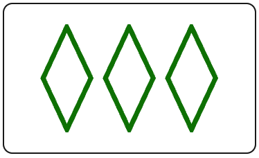

# SetSolver
A program to win at Set with Friends
## Instructions
Run main.py and then quickly switch over to a fullscreen tab with a Set with Friends (https://setwithfriends.com/) game running.
This program will then automatically detect the Set cards on the board, determine which of the detected cards make a set,
and then click on the cards in quick succession. This process will repeat indefinitely, so terminate the program after
the game has been completed. The program is currently configured for the M2 Macbook Air with a 2560 × 1664 resolution. 
Changes to the defined board region will need to be made in mss_detection.py to comply with different display configurations.
## Motivation
I decided to start this project for two reasons:
1. I wanted a coding project that would allow me to strengthen my Python development skills. I was hoping to create a codebase 
utilizing computer vision and automation libraries to interact with a website in realtime.
2. My friends and I had been playing a lot of Set and I was tired of losing.
## Development Process
### Experimentation
My initial goal was getting a python program to interact with a browser tab. By passing an image of a text box, I was
then able to use pyautogui "locate", "click", and "write" functions to find the text box, click and then type out a message.
Next, I wanted to verify sequential image detection so I took screenshots of buttons of numbers and operators on Google's 
calculator page, and then similarly used "locate" and "click" to compute a basic math equation. The final test was to try the
sequential detection out on a Set with Friends game. I saved photos of 3 set cards that contained a set and then automated a
series of clicks to give the program its first set.
### Data Collection
In total, I saved screenshots of all 81 possible Set cards by playing through a full game individually. For each photo I included
the full area contained withing the border of a card, with some minor padding outside of it. This was done so that, for example,
during image detection a set Card containing a single diamond wouldn't be found within a card that contained three diamonds with 
the same attributes. After gathering the screenshots, I then converted each image to png format using "Paintbrush" 
(https://paintbrush.sourceforge.io/) naming each file based upon the attributes of the Set card the image contained, in the format
color_number_shape_filling, to make later filename conversion simple. Lastly, I stored them in the "iconPics" folder. Below is
an example of a set card from the folder:

  

## Para 1
test para
## Para 2
test para 2

